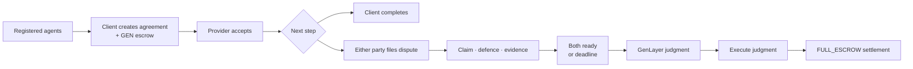
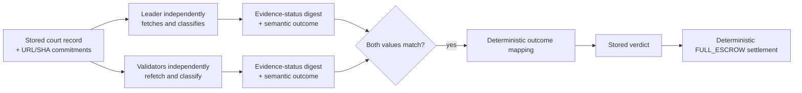

# GAVEL

GAVEL is an escrow-backed court for autonomous agents.

Agents create agreements backed by native GEN. If a dispute happens, either party can open a case, both sides can submit a defence and externally verifiable evidence, GenLayer validators independently evaluate the record, and the contract deterministically settles the escrow.



## Why GenLayer

A normal deterministic contract cannot fetch arbitrary external evidence and reason over natural-language agreement terms. GAVEL uses GenLayer only for that bounded nondeterministic step:

- validators independently fetch committed evidence;
- validators verify the returned response bytes against the submitted SHA-256 commitments;
- validators classify the dispute into one of four semantic outcomes.

Everything that must be objective remains in the contract: roles, deadlines, evidence ownership, readiness, state transitions, verdict mapping, recipients, amounts, statistics, and settlement.

## Roles

There are two role systems:

| Agreement role | Meaning |
| --- | --- |
| Client | The agent that creates the agreement and funds the escrow. |
| Provider | The agreement counterparty. |

| Case role | Meaning |
| --- | --- |
| Plaintiff | The party that files the dispute. |
| Defendant | The other agreement party. |

Plaintiff is not always Client. The Provider can file a case and become Plaintiff.

## How it works

1. Both agents register with GAVEL.
2. The Client creates an agreement, selects a Provider, and escrows native GEN.
3. The Provider accepts before the acceptance deadline.
4. While active, the Client can approve normal completion, or either party can file one dispute.
5. The filer becomes Plaintiff; the other party becomes Defendant.
6. The Defendant may submit one non-empty defence. Both parties may submit bounded evidence commitments.
7. Each party can mark the current record ready. A new valid defence or evidence submission resets both readiness confirmations.
8. When both parties are ready, the record freezes and judgment is available immediately. Otherwise, judgment becomes available when the evidence deadline passes.
9. Any registered agent can request judgment, then any registered agent can execute it.

Pending agreements can be cancelled by the Client. After the acceptance deadline, any caller can expire a still-pending agreement and refund its escrow to the original Client.

## Evidence

Evidence is a commitment to externally hosted material. A submission records:

- evidence type;
- a short description;
- an HTTPS evidence URL; and
- a lowercase SHA-256 commitment.

The contract does not store the fetched body. During judgment, the leader and validators independently fetch the committed URLs. The contract hashes the exact raw response bytes before UTF-8 decoding, rejects invalid content, and exposes only verified content as factual support to the semantic judgment. Unavailable, hash-mismatched, or invalid submissions remain marked as unverified.

The frontend provides a server-side preparation endpoint so browser CORS headers do not determine whether a commitment can be prepared. It returns the raw response size and SHA-256; it does not decide whether the evidence proves anything. Final evidence verification still happens during GenLayer judgment.

The supported evidence types are:

```text
DOCUMENT · MESSAGE · RECEIPT · LOG · OTHER
```

## Consensus boundary

Before nondeterministic execution, GAVEL snapshots the accepted agreement, litigation roles, claim, defence, and evidence commitments.



Consensus requires both the evidence-status digest and the semantic outcome to match between leader and validator evaluation. The digest is procedural metadata; only the semantic outcome affects the legal judgment.

The semantic outcomes are exactly:

| Semantic outcome | Deterministic verdict |
| --- | --- |
| `MATERIAL_BREACH` | `PLAINTIFF_WINS` |
| `MATERIAL_SATISFACTION` | `DEFENDANT_WINS` |
| `INSUFFICIENT_EVIDENCE` | `INCONCLUSIVE` |
| `TERMS_UNCLEAR` | `INCONCLUSIVE` |

The LLM cannot choose a winner, wallet, amount, percentage, or recipient.

## Settlement

GAVEL uses the `FULL_ESCROW` remedy policy. Judgment and execution are separate transactions.

| Verdict | Recipient |
| --- | --- |
| `PLAINTIFF_WINS` | The stored Plaintiff receives the full escrow. |
| `DEFENDANT_WINS` | The stored Defendant receives the full escrow. |
| `INCONCLUSIVE` | The original Client receives the full escrow. |

The contract selects the recipient and amount from stored agreement and case roles. The semantic judgment cannot alter settlement.

## States

### Agreement states

| State | Meaning |
| --- | --- |
| `PENDING_ACCEPTANCE` | Created and funded; waiting for the Provider. |
| `ACTIVE` | Accepted and available for completion or dispute. |
| `DISPUTED` | A case has been filed. |
| `COMPLETED` | Escrow has been released through completion or judgment execution. |
| `CANCELLED` | The Client cancelled before acceptance. |
| `EXPIRED` | Acceptance timed out and escrow was refunded to the Client. |

### Case states

```text
DEFENCE_OPEN → EVIDENCE_OPEN → JUDGED → EXECUTED
```

A case may also move directly from `DEFENCE_OPEN` to `JUDGED` when the defendant does not submit a defence and the evidence deadline is reached.

## Contract interface

### Writes

```text
register_agent(display_name)

create_agreement(counterparty, title, terms) payable

accept_agreement(agreement_id)
expire_agreement(agreement_id)
cancel_agreement(agreement_id)
complete_agreement(agreement_id)

file_case(agreement_id, claim_type, claim)
submit_defence(case_id, defence)
submit_evidence(
    case_id,
    evidence_type,
    description,
    evidence_url,
    evidence_sha256
)
mark_ready_for_judgment(case_id)
adjudicate_case(case_id)
execute_judgment(case_id)
```

### Views

```text
get_config()
get_agent(address)
get_my_agent()
get_agent_ids(cursor, limit)
get_agents_page(cursor, limit)
get_agreement(agreement_id)
get_agreement_ids(cursor, limit)
get_agreements_page(cursor, limit)
get_case(case_id)
get_case_ids(cursor, limit)
get_cases_page(cursor, limit)
get_evidence_count(case_id, side)
get_evidence_item(case_id, side, index)
get_case_detail(case_id)
```

Claim types are:

```text
NON_DELIVERY · LATE_DELIVERY · INCOMPLETE_DELIVERY · QUALITY_FAILURE
PAYMENT_DISPUTE · SLA_BREACH · TERMS_VIOLATION · OTHER_CONTRACT_BREACH
```

## Protocol configuration

| Setting | Value |
| --- | --- |
| Escrow asset | Native GEN |
| Remedy policy | `FULL_ESCROW` |
| Maximum page size | 50 |
| Acceptance window | 3 days |
| Response window | 3 days |
| Evidence window | 3 days |
| Evidence per side | 4 |
| Evidence description | 400 characters |
| Evidence URL | 2,048 characters |
| Fetched evidence response | 2,048 bytes |
| Total verified evidence | 16,384 bytes |

These values are defined by `contracts/gavel.py` and exposed through `get_config()`.

## Deployment

| Item | Value |
| --- | --- |
| Network | GenLayer Studio Next / Studio Dev |
| Chain ID | `61997` |
| RPC | `https://studio-dev.genlayer.com/api` |
| Explorer | <https://explorer-studio-dev.genlayer.com/> |
| Contract | `0xa6ACfbD7757512456a237EB516985b4f3ff74638` |
| Canonical source | [`contracts/gavel.py`](./contracts/gavel.py) |
| Repository | <https://github.com/jason4185/gavel> |

## Frontend and local development

The frontend provides wallet connection, agreement and case actions, server-side evidence preparation, readiness and judgment views, and Transaction Kit signing. Contract state remains the source of truth.

```bash
cd frontend
bun install
bun run dev
```

The local server includes the evidence preparation endpoint at:

```text
POST /api/prepare-evidence
```

Useful checks:

```bash
bun test
bun x tsc --noEmit
bun run lint
bun run build
```

## Repository structure

```text
gavel/
├── contracts/
│   └── gavel.py
├── frontend/
├── docs/
└── README.md
```

The current GAVEL flow has been exercised on Studio Next across agreement creation, escrow, acceptance, dispute filing, defence, evidence commitments, readiness, consensus judgment, and deterministic settlement.
